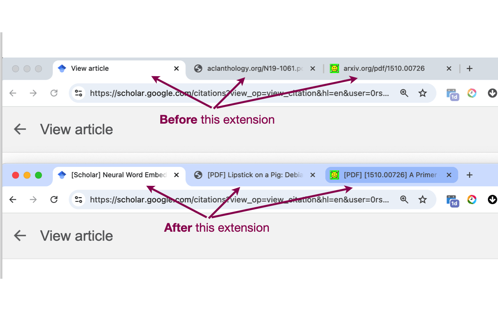
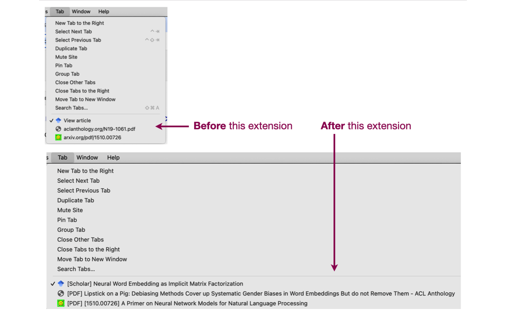

# pdf-tab-renamer

Chrome extension for renaming tabs showing paper-pdfs from common providers.

Some websites that show scientific papers use an uninformative page title (e.g., Google Scholar's "View article" pages).
And in some cases we just show the PDF page directly in the browser, using the PDF's name as the Tab's title.

This results in uninformative Tab names, making items hard to find and navigate.

This simple extensions handles this situation for specific websites, by inferring the paper's name and updating the Tab's title. 




The extension currently handles:

- PDFs urls from:
    - arxiv.org
    - mlr.press / jmlr.press (including ICML)
    - neurips.cc
    - aclanthology.org
    - openreview.net (including ICLR)
    - openaccess.thecvf.com
    - ieeexplore.ieee.org (not very well tested)
    - biorxiv
    - dl.acm.org
- The 'View article' page of Google Scholar

# Installing

At some point this will be in the chrome extension store. Until then, install as a local package.

- Clone the repo or download a zip.
- Enable developer-mode in the chrome extensions manager.
- Click "Load unpacked" and point to the `dist/` folder.

Here is a [Random page with instructions](https://dev.to/ben/how-to-install-chrome-extensions-manually-from-github-1612), but point to the `dist/` folder and not to the root.

# Contributing

The extension does not handle your favourite paper provider? help extend it!

The logic in [src/background.ts](src/background.ts) should be easy to follow and extend. Just submit a PR.

**Building**

```bash
yarn install
yarn build
```
